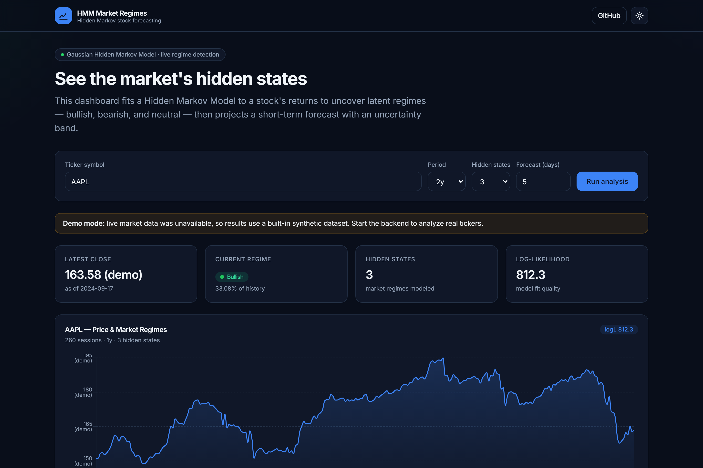
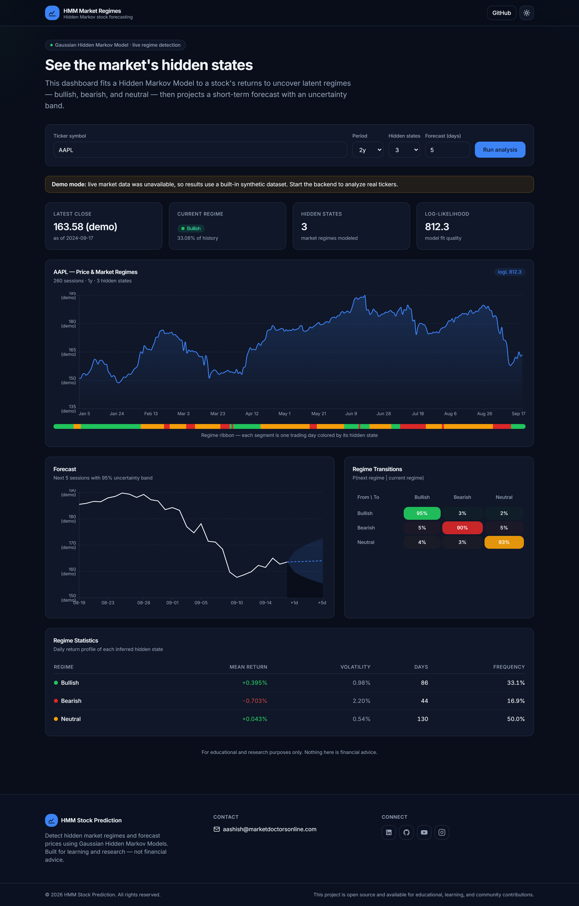
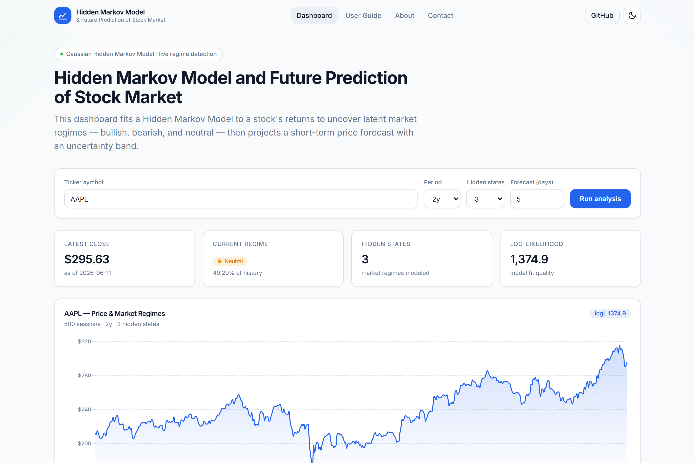
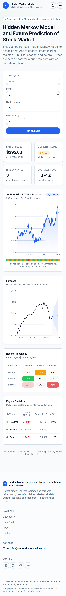
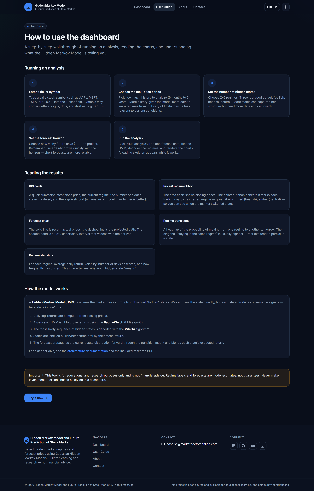
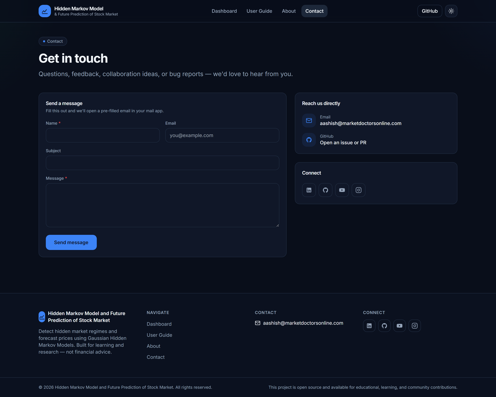

<div align="center">

# 📈 Hidden Markov Model and Future Prediction of Stock Market

### Detect hidden market regimes and forecast prices with Hidden Markov Models

A full-stack, open-source dashboard that fits a **Gaussian Hidden Markov Model**
to a stock's returns to uncover latent regimes — **bullish, bearish, neutral** —
and projects a short-term forecast with an uncertainty band.

[](https://github.com/aashishbharti04/hmm-stock-prediction/actions/workflows/ci.yml)
[](LICENSE)
[](https://nextjs.org/)
[](https://fastapi.tiangolo.com/)
[](https://www.typescriptlang.org/)
[](CONTRIBUTING.md)

</div>

> ⚠️ **Disclaimer:** This project is for **educational and research purposes
> only**. It is **not financial advice**. Markets are uncertain; use at your own risk.

---

## 📑 Table of Contents

- [Overview](#-overview)
- [Features](#-features)
- [Screenshots](#-screenshots)
- [Tech Stack](#-tech-stack)
- [Installation](#-installation)
- [Usage](#-usage)
- [Configuration](#-configuration)
- [Deployment](#-deployment)
- [Documentation](#-documentation)
- [Contributing](#-contributing)
- [FAQ](#-faq)
- [License](#-license)
- [Contact](#-contact)

---

## 🔍 Overview

A **Hidden Markov Model (HMM)** assumes the market moves through unobserved
"hidden" states, each emitting observable signals (here, daily log-returns). This
app:

1. Fetches historical OHLCV data (`yfinance`).
2. Fits a Gaussian HMM over log-returns (**Baum–Welch / EM**).
3. Decodes the most-likely regime sequence (**Viterbi**).
4. Labels regimes **Bullish / Bearish / Neutral** and computes their statistics.
5. Estimates the **transition matrix** between regimes.
6. **Forecasts** future prices by propagating the state distribution forward,
   with a 95% uncertainty band.

It ships as two independent tiers — a **FastAPI** modeling backend and a
**Next.js + TypeScript** dashboard — connected by a single JSON contract.

See [docs/ARCHITECTURE.md](docs/ARCHITECTURE.md) for the full design.

---

## ✨ Features

**Modeling**

- 🧠 **Real HMM engine** — Gaussian HMM via `hmmlearn` (fit, Viterbi decode, forecast)
- 🎲 **Multi-restart fitting** — N random EM restarts, best-likelihood wins (EM is init-sensitive)
- 🧪 **Automatic regime-count selection** — choose `n_states` objectively by **BIC/AIC**
- 📐 **Walk-forward backtesting** — out-of-sample directional accuracy, RMSE & MAPE vs a naive baseline
- 📊 **Regime detection** — bullish/bearish/neutral states with per-regime stats
- 🔮 **Forecasting** — multi-step price forecast with a 95% mixture-variance band

**Production backend**

- ⚡ **Caching** — TTL/LRU in-memory by default, optional **Redis** for multi-replica
- 🚦 **Rate limiting** — fixed-window limiter per API key / IP
- 🔑 **Optional API-key auth** — opt-in `X-API-Key` on mutating endpoints
- 📈 **Observability** — **Prometheus** `/metrics`, JSON structured logs, per-request correlation IDs
- 🩺 **Health & readiness probes** — `/health`, `/ready`
- 🛡️ **Resilient data layer** — retries with backoff + a **circuit breaker** over `yfinance`

**Frontend & UX**

- 🔁 **TanStack Query** — request caching, retries with backoff, cancellation
- 🔥 **Transition heatmap** + 🌗 **dark/light mode** + 📱 **responsive** layouts
- ⏳ **Polished states** — loading skeletons, empty & error states
- ♿ **Accessible** & 🔍 **SEO-ready** (metadata, OpenGraph, robots, sitemap, manifest)
- 🛟 **Graceful degradation** — built-in demo dataset when the backend is offline

**Engineering**

- 🐳 **Docker Compose** — one command for backend + frontend + Redis, multi-stage images with healthchecks
- ✅ **Tested & linted** — pytest, ruff, mypy (enforced), ESLint, TS strict, **Playwright E2E**
- 🔒 **Security CI** — **CodeQL**, **Trivy**, **SBOM**, Dependabot, **pre-commit** (gitleaks)

---

## 📸 Screenshots

<div align="center">

### Dashboard — Dark Mode


### Full Dashboard


### Light Mode


<table>
<tr>
<td width="50%"><b>Mobile</b><br/></td>
<td width="50%" valign="top">

**Highlights**

- KPI cards: latest close, current regime, hidden states, model fit
- Price chart with a per-day **regime ribbon**
- Forecast chart with a shaded **95% band**
- **Transition-probability** heatmap
- Per-regime statistics table

</td>
</tr>
</table>

### Pages

| User Guide | Contact |
|:---:|:---:|
|  |  |

The app includes **Dashboard**, **User Guide**, **About**, and **Contact** pages.

</div>

---

## 🛠 Tech Stack

| Layer     | Technologies                                                        |
|-----------|---------------------------------------------------------------------|
| Frontend  | Next.js 14 (App Router), TypeScript, Tailwind CSS, Recharts, **TanStack Query**, next-themes |
| Backend   | Python, FastAPI, Pydantic, hmmlearn, scikit-learn, NumPy, pandas, yfinance, **prometheus-client** |
| Infra     | **Docker Compose**, multi-stage Docker images, **Redis** (optional), Makefile |
| Tooling   | pytest · ruff · mypy · ESLint · Prettier · **Playwright** · **pre-commit** · GitHub Actions |
| Security  | **CodeQL** · **Trivy** · **SBOM (SPDX)** · gitleaks · Dependabot     |

---

## 🚀 Installation

> **Requirements:** Python **3.10–3.12** and Node **18.18+**.
> (Python 3.13/3.14 may force slow source builds of `hmmlearn`/`pydantic-core`.)

```bash
git clone https://github.com/aashishbharti04/hmm-stock-prediction.git
cd hmm-stock-prediction
```

**Backend**

```bash
cd backend
python -m venv .venv
source .venv/bin/activate          # Windows: .venv\Scripts\activate
pip install -r requirements-dev.txt
cp .env.example .env               # Windows: copy .env.example .env
uvicorn app.main:app --reload      # → http://localhost:8000  (docs at /docs)
```

**Frontend** (new terminal)

```bash
cd frontend
npm install
cp .env.example .env.local         # Windows: copy .env.example .env.local
npm run dev                        # → http://localhost:3000
```

Full guide: [docs/DEVELOPMENT.md](docs/DEVELOPMENT.md).

---

## 📖 Usage

1. Open **http://localhost:3000**.
2. Enter a **ticker** (e.g. `AAPL`, `MSFT`, `TSLA`).
3. Choose the **period**, number of **hidden states** (2–5), and **forecast horizon** (1–30 days).
4. Click **Run analysis**.
5. Explore the regime ribbon, forecast band, transition heatmap, and per-regime stats.

> The dashboard renders a built-in **demo dataset** if the backend isn't running,
> so you can explore the UI immediately.

**API directly:**

```bash
curl -X POST http://localhost:8000/api/v1/analyze \
  -H "Content-Type: application/json" \
  -d '{"ticker":"AAPL","period":"2y","n_states":3,"forecast_days":5}'
```

Full API reference: [docs/API.md](docs/API.md).

---

## ⚙️ Configuration

Configuration is via environment variables. Copy the provided templates and edit.

**Backend** — `backend/.env` (from `backend/.env.example`)

| Variable                | Default                  | Description                       |
|-------------------------|--------------------------|-----------------------------------|
| `ENVIRONMENT`           | `development`            | `development` or `production`     |
| `DEBUG`                 | `true`                   | Verbose logging                   |
| `CORS_ORIGINS`          | `http://localhost:3000`  | Comma-separated allowed origins   |
| `DEFAULT_HIDDEN_STATES` | `3`                      | Default regime count              |
| `HMM_N_ITER`            | `100`                    | EM iterations                     |
| `HMM_N_RESTARTS`        | `8`                      | Random EM restarts (best wins)    |
| `MAX_FORECAST_DAYS`     | `30`                     | Forecast horizon cap              |
| `CACHE_TTL_SECONDS`     | `900`                    | Result cache TTL                  |
| `REDIS_URL`             | _(unset)_                | Use Redis cache instead of memory |
| `RATE_LIMIT_REQUESTS`   | `60`                     | Requests per window per client    |
| `API_KEYS`              | _(empty)_                | Comma-separated keys; enables auth|
| `LOG_JSON`              | `false`                  | JSON structured logs (production) |
| `METRICS_ENABLED`       | `true`                   | Expose Prometheus `/metrics`      |

See [`backend/.env.example`](backend/.env.example) for the full list (retries,
circuit breaker, model-selection range, etc.).

**Frontend** — `frontend/.env.local` (from `frontend/.env.example`)

| Variable                   | Default                          | Description            |
|----------------------------|----------------------------------|------------------------|
| `NEXT_PUBLIC_API_BASE_URL` | `http://localhost:8000/api/v1`   | Backend API base URL   |
| `NEXT_PUBLIC_SITE_URL`     | `http://localhost:3000`          | Site URL for SEO links |

> 🔒 Never commit a real `.env`. Only `.env.example` templates are tracked.

---

## ☁️ Deployment

**Whole stack with one command** (backend + frontend + Redis):

```bash
docker compose up --build
# Frontend → http://localhost:3000   ·   API docs → http://localhost:8000/docs
```

Or deploy the tiers independently — e.g. **Vercel** (frontend) + **Docker** on
any container host (backend):

```bash
cd backend && docker build -t hmm-api . && docker run -p 8000:8000 hmm-api
```

Both images are **multi-stage** with non-root users and container **healthchecks**.
A `Makefile` wraps common tasks (`make help`). Step-by-step hosting guides
(Vercel, Render, Railway, Fly.io, Cloud Run, VM): [docs/DEPLOYMENT.md](docs/DEPLOYMENT.md).

---

## 📚 Documentation

| Doc | Description |
|-----|-------------|
| [Architecture](docs/ARCHITECTURE.md)       | System design, data flow, trade-offs |
| [Folder Structure](docs/FOLDER_STRUCTURE.md)| Where everything lives               |
| [API Reference](docs/API.md)               | Endpoints, schemas, examples         |
| [Deployment](docs/DEPLOYMENT.md)           | Hosting the frontend & backend       |
| [Development](docs/DEVELOPMENT.md)         | Local setup & troubleshooting        |

The original research write-up is included as
[`Hidden Markov Model and Future Prediction of stock Market (2).pdf`](./Hidden%20Markov%20Model%20and%20Future%20Prediction%20of%20stock%20Market%20(2).pdf).

---

## 🤝 Contributing

Contributions are welcome! Please read [CONTRIBUTING.md](CONTRIBUTING.md) and our
[Code of Conduct](CODE_OF_CONDUCT.md). Use the issue and PR templates in
[`.github/`](.github). Good first steps:

- 🐛 [Report a bug](.github/ISSUE_TEMPLATE/bug_report.md)
- 💡 [Request a feature](.github/ISSUE_TEMPLATE/feature_request.md)

---

## ❓ FAQ

<details>
<summary><b>Is this financial advice?</b></summary>

No. It's an educational/research tool. HMM regimes are a modeling lens, not a
prediction guarantee. Do not trade on it.
</details>

<details>
<summary><b>The dashboard says "Demo mode" — why?</b></summary>

The backend wasn't reachable, so the frontend rendered a built-in synthetic
dataset. Start the backend and confirm `NEXT_PUBLIC_API_BASE_URL` points to it.
</details>

<details>
<summary><b>I get a build error installing <code>hmmlearn</code>.</b></summary>

You're likely on Python 3.13/3.14, which lacks prebuilt wheels. Use Python
**3.10–3.12**.
</details>

<details>
<summary><b>Why log-returns instead of raw prices?</b></summary>

Log-returns are closer to stationary, which makes the HMM's regimes more
identifiable and stabilizes fitting.
</details>

<details>
<summary><b>Can I use a different data source?</b></summary>

Yes — implement the same interface as <code>services/market_data.py</code> and
swap it in. The modeling core is data-source-agnostic.
</details>

---

## 📄 License

Distributed under the **MIT License**. See [LICENSE](LICENSE) for details.

This project is open source and available for educational, learning, and
community contributions.

---

## 📬 Contact

**Aashish Bharti**

[](mailto:aashish@marketdoctorsonline.com)
[](https://in.linkedin.com/in/aashana1012)
[](https://github.com/aashishbharti04)
[](https://www.youtube.com/@CodeWithAsur)
[](https://www.instagram.com/asurwave1012?igsh=ZDBlY2NtczJ5cmMw)

<div align="center">

---

⭐ **If you find this useful, consider starring the repo!**

© 2026 Hidden Markov Model and Future Prediction of Stock Market. All rights reserved.

</div>
